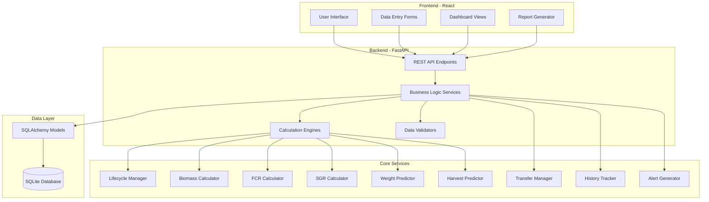
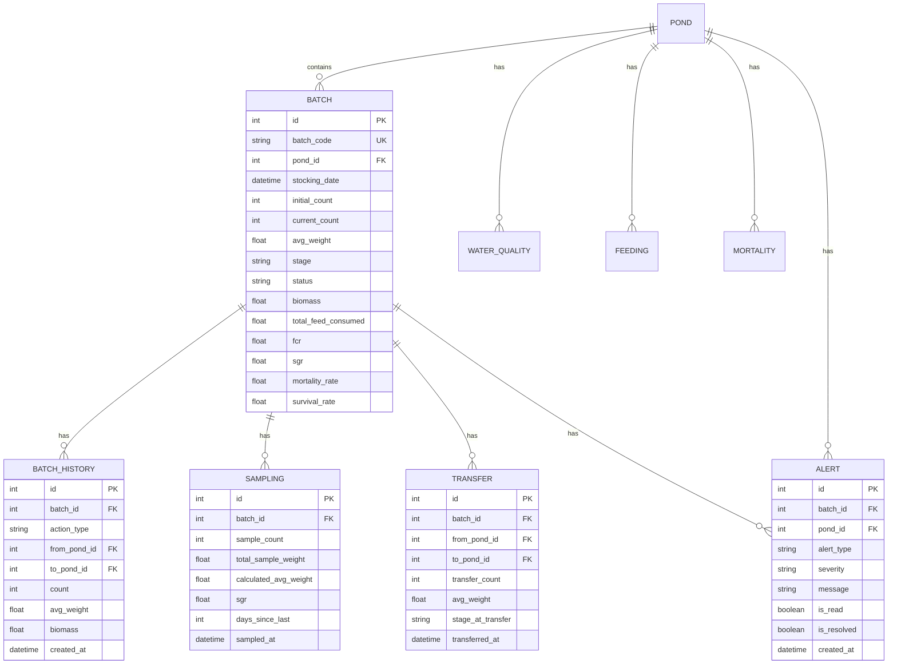

# Design Document: Fish Lifecycle Management
# مستند التصميم: إدارة دورة حياة السمكة

## Overview

This design document specifies the technical implementation for complete fish lifecycle management in the Tibyan aquaculture system. The feature tracks tilapia fish from eggs through harvest across 6 lifecycle stages, calculating key performance indicators (FCR, SGR, biomass, mortality rates) and providing predictive analytics for weight and harvest timing.

### System Context

- **Backend**: Python FastAPI + SQLAlchemy + SQLite
- **Frontend**: React + Vite + Tailwind CSS
- **Current State**: 85% complete with basic pond, feeding, mortality, and water quality tracking
- **This Feature**: Adds critical lifecycle logic, calculations, transfers, predictions, and comprehensive reporting

### Key Capabilities

1. **Batch Lifecycle Tracking**: Complete tracking from stocking to harvest with automatic stage transitions
2. **Real-time Calculations**: Biomass, FCR, SGR, mortality rates updated after every event
3. **Predictive Analytics**: Weight and harvest date predictions based on growth rates
4. **Transfer Management**: Inter-pond transfers with full history tracking
5. **Automatic Alerts**: Proactive notifications for critical conditions
6. **Comprehensive Reporting**: Detailed batch reports with all KPIs and history

---

## Architecture

### High-Level Architecture



### Service Layer Architecture

The system follows a layered architecture with clear separation of concerns:

1. **API Layer**: FastAPI endpoints handling HTTP requests/responses
2. **Service Layer**: Business logic orchestration and workflow management
3. **Calculator Layer**: Specialized calculation engines for KPIs
4. **Data Layer**: SQLAlchemy models and database operations
5. **Validation Layer**: Input validation and business rule enforcement

---

## Components and Interfaces

### 1. Database Models

#### Extended Batch Model

```python
class Batch(Base):
    __tablename__ = "batches"
    
    # Existing fields
    id = Column(Integer, primary_key=True)
    batch_code = Column(String, unique=True, nullable=False)
    pond_id = Column(Integer, ForeignKey("ponds.id"))
    stocking_date = Column(DateTime(timezone=True), nullable=False)
    initial_count = Column(Integer, nullable=False)
    current_count = Column(Integer, nullable=False)
    avg_weight = Column(Float, nullable=False)  # grams
    stage = Column(String, nullable=False)
    source = Column(String)
    supplier = Column(String)
    status = Column(String, default="active")
    created_by = Column(String)
    created_at = Column(DateTime(timezone=True), server_default=func.now())
    
    # NEW: Calculated fields
    biomass = Column(Float)  # grams (current_count * avg_weight)
    total_feed_consumed = Column(Float, default=0.0)  # kg
    fcr = Column(Float)  # Feed Conversion Ratio
    sgr = Column(Float)  # Specific Growth Rate (%)
    mortality_rate = Column(Float, default=0.0)  # percentage
    survival_rate = Column(Float, default=100.0)  # percentage
    
    # NEW: Tracking fields
    previous_avg_weight = Column(Float)  # for SGR calculation
    last_sampling_date = Column(DateTime(timezone=True))
    harvest_date = Column(DateTime(timezone=True))
    cycle_duration = Column(Integer)  # days
    
    # Relationships
    pond = relationship("Pond", back_populates="batches")
    history = relationship("BatchHistory", back_populates="batch", cascade="all, delete-orphan")
    samplings = relationship("Sampling", back_populates="batch", cascade="all, delete-orphan")
    transfers = relationship("Transfer", back_populates="batch", cascade="all, delete-orphan")
    alerts = relationship("Alert", back_populates="batch", cascade="all, delete-orphan")
```

#### NEW: BatchHistory Model

```python
class BatchHistory(Base):
    __tablename__ = "batch_history"
    
    id = Column(Integer, primary_key=True)
    batch_id = Column(Integer, ForeignKey("batches.id"), nullable=False)
    action_type = Column(String, nullable=False)  # created, transfer, sampling, mortality, feeding, water_quality, harvest
    
    # Transfer fields
    from_pond_id = Column(Integer, ForeignKey("ponds.id"))
    to_pond_id = Column(Integer, ForeignKey("ponds.id"))
    
    # Common fields
    count = Column(Integer)  # fish count for the event
    avg_weight = Column(Float)  # grams
    biomass = Column(Float)  # grams
    
    # Metadata
    notes = Column(Text)
    created_by = Column(String)
    created_at = Column(DateTime(timezone=True), server_default=func.now())
    
    # Relationships
    batch = relationship("Batch", back_populates="history")
    from_pond = relationship("Pond", foreign_keys=[from_pond_id])
    to_pond = relationship("Pond", foreign_keys=[to_pond_id])
```

#### NEW: Sampling Model

```python
class Sampling(Base):
    __tablename__ = "samplings"
    
    id = Column(Integer, primary_key=True)
    batch_id = Column(Integer, ForeignKey("batches.id"), nullable=False)
    
    # Sampling data
    sample_count = Column(Integer, nullable=False)  # number of fish sampled
    total_sample_weight = Column(Float, nullable=False)  # grams
    calculated_avg_weight = Column(Float, nullable=False)  # grams
    previous_avg_weight = Column(Float)  # grams
    
    # Calculated metrics
    sgr = Column(Float)  # Specific Growth Rate (%)
    days_since_last = Column(Integer)  # days since last sampling
    
    # Metadata
    sampled_by = Column(String, nullable=False)
    notes = Column(Text)
    sampled_at = Column(DateTime(timezone=True), server_default=func.now())
    
    # Relationships
    batch = relationship("Batch", back_populates="samplings")
```

#### NEW: Transfer Model

```python
class Transfer(Base):
    __tablename__ = "transfers"
    
    id = Column(Integer, primary_key=True)
    batch_id = Column(Integer, ForeignKey("batches.id"), nullable=False)
    
    # Transfer data
    from_pond_id = Column(Integer, ForeignKey("ponds.id"), nullable=False)
    to_pond_id = Column(Integer, ForeignKey("ponds.id"), nullable=False)
    transfer_count = Column(Integer, nullable=False)
    avg_weight = Column(Float, nullable=False)  # grams at transfer
    stage_at_transfer = Column(String)
    
    # Metadata
    transferred_by = Column(String, nullable=False)
    notes = Column(Text)
    transferred_at = Column(DateTime(timezone=True), server_default=func.now())
    
    # Relationships
    batch = relationship("Batch", back_populates="transfers")
    from_pond = relationship("Pond", foreign_keys=[from_pond_id])
    to_pond = relationship("Pond", foreign_keys=[to_pond_id])
```

#### NEW: Alert Model

```python
class Alert(Base):
    __tablename__ = "alerts"
    
    id = Column(Integer, primary_key=True)
    batch_id = Column(Integer, ForeignKey("batches.id"))
    pond_id = Column(Integer, ForeignKey("ponds.id"))
    
    # Alert data
    alert_type = Column(String, nullable=False)  # fcr_high, sgr_low, mortality_high, transfer_ready, harvest_ready, water_quality
    severity = Column(String, nullable=False)  # info, warning, critical
    message = Column(Text, nullable=False)
    
    # Status
    is_read = Column(Boolean, default=False)
    is_resolved = Column(Boolean, default=False)
    resolved_by = Column(String)
    resolved_at = Column(DateTime(timezone=True))
    
    # Metadata
    created_at = Column(DateTime(timezone=True), server_default=func.now())
    
    # Relationships
    batch = relationship("Batch", back_populates="alerts")
    pond = relationship("Pond")
```

### 2. API Schemas

#### Batch Schemas

```python
class BatchCreate(BaseModel):
    batch_code: str
    pond_id: int
    stocking_date: datetime
    initial_count: int
    avg_weight: float  # grams
    stage: str
    source: Optional[str] = None
    supplier: Optional[str] = None
    created_by: str

class BatchResponse(BaseModel):
    id: int
    batch_code: str
    pond_id: int
    stocking_date: datetime
    initial_count: int
    current_count: int
    avg_weight: float
    stage: str
    status: str
    biomass: Optional[float]
    fcr: Optional[float]
    sgr: Optional[float]
    mortality_rate: float
    survival_rate: float
    created_at: datetime
    
    class Config:
        from_attributes = True

class BatchDetailResponse(BatchResponse):
    total_feed_consumed: float
    last_sampling_date: Optional[datetime]
    harvest_date: Optional[datetime]
    cycle_duration: Optional[int]
    pond: PondResponse
    history: List[BatchHistoryResponse]
    samplings: List[SamplingResponse]
    transfers: List[TransferResponse]
    alerts: List[AlertResponse]
```

#### Sampling Schemas

```python
class SamplingCreate(BaseModel):
    batch_id: int
    sample_count: int  # minimum 30
    total_sample_weight: float  # grams
    sampled_by: str
    notes: Optional[str] = None

class SamplingResponse(BaseModel):
    id: int
    batch_id: int
    sample_count: int
    total_sample_weight: float
    calculated_avg_weight: float
    previous_avg_weight: Optional[float]
    sgr: Optional[float]
    days_since_last: Optional[int]
    sampled_by: str
    sampled_at: datetime
    
    class Config:
        from_attributes = True
```

#### Transfer Schemas

```python
class TransferCreate(BaseModel):
    batch_id: int
    from_pond_id: int
    to_pond_id: int
    transfer_count: int
    transferred_by: str
    notes: Optional[str] = None

class TransferResponse(BaseModel):
    id: int
    batch_id: int
    from_pond_id: int
    to_pond_id: int
    transfer_count: int
    avg_weight: float
    stage_at_transfer: str
    transferred_by: str
    transferred_at: datetime
    
    class Config:
        from_attributes = True
```

#### Prediction Schemas

```python
class WeightPredictionRequest(BaseModel):
    batch_id: int
    days_ahead: int

class WeightPredictionResponse(BaseModel):
    batch_id: int
    current_avg_weight: float
    predicted_weight: float
    days_ahead: int
    sgr_used: float
    confidence_level: str  # high, medium, low
    prediction_date: datetime

class HarvestPredictionRequest(BaseModel):
    batch_id: int
    target_weight: float = 450.0  # default market weight

class HarvestPredictionResponse(BaseModel):
    batch_id: int
    current_avg_weight: float
    target_weight: float
    days_remaining: int
    predicted_harvest_date: date
    sgr_used: float
    confidence_level: str
```

### 3. Service Layer Components

#### LifecycleManager Service

```python
class LifecycleManager:
    """Manages fish lifecycle stage transitions"""
    
    STAGE_THRESHOLDS = {
        "eggs": (0, 0.001),
        "fry": (0.001, 0.1),
        "fingerlings": (0.1, 1.0),
        "juveniles": (1.0, 30.0),
        "young_fish": (30.0, 200.0),
        "fattening": (200.0, float('inf'))
    }
    
    def determine_stage(self, avg_weight: float) -> str:
        """Determine lifecycle stage based on average weight"""
        
    def update_stage(self, batch: Batch, db: Session) -> bool:
        """Update batch stage if weight threshold crossed"""
        
    def get_stage_info(self, stage: str) -> dict:
        """Get feeding and management info for stage"""
```

#### BiomassCalculator Service

```python
class BiomassCalculator:
    """Calculates and updates batch biomass"""
    
    def calculate_biomass(self, current_count: int, avg_weight: float) -> float:
        """Calculate biomass = current_count * avg_weight"""
        
    def update_batch_biomass(self, batch: Batch, db: Session) -> float:
        """Recalculate and update batch biomass"""
```

#### FCRCalculator Service

```python
class FCRCalculator:
    """Calculates Feed Conversion Ratio"""
    
    def calculate_fcr(
        self, 
        total_feed_consumed: float,  # kg
        initial_weight: float,  # grams
        final_weight: float,  # grams
        current_count: int
    ) -> Optional[float]:
        """Calculate FCR = total_feed / weight_gained"""
        
    def update_batch_fcr(self, batch: Batch, db: Session) -> Optional[float]:
        """Recalculate and update batch FCR"""
        
    def classify_fcr(self, fcr: float) -> str:
        """Classify FCR as excellent, good, or poor"""
```

#### SGRCalculator Service

```python
class SGRCalculator:
    """Calculates Specific Growth Rate"""
    
    def calculate_sgr(
        self,
        initial_weight: float,  # grams
        final_weight: float,  # grams
        days_elapsed: int
    ) -> Optional[float]:
        """Calculate SGR = ((ln(W2) - ln(W1)) / days) * 100"""
        
    def update_batch_sgr(
        self, 
        batch: Batch, 
        new_avg_weight: float,
        sampling_date: datetime,
        db: Session
    ) -> Optional[float]:
        """Calculate and update SGR after sampling"""
        
    def classify_sgr(self, sgr: float) -> str:
        """Classify SGR as excellent, good, or poor"""
```

#### WeightPredictor Service

```python
class WeightPredictor:
    """Predicts future fish weight"""
    
    def predict_weight(
        self,
        current_weight: float,  # grams
        sgr: float,  # percentage
        days_ahead: int
    ) -> float:
        """Predict weight = current_weight * e^(SGR * days / 100)"""
        
    def get_prediction_confidence(
        self,
        batch: Batch,
        db: Session
    ) -> str:
        """Determine confidence level based on data recency"""
```

#### HarvestPredictor Service

```python
class HarvestPredictor:
    """Predicts harvest date"""
    
    def predict_harvest_date(
        self,
        current_weight: float,  # grams
        target_weight: float,  # grams
        sgr: float  # percentage
    ) -> Optional[int]:
        """Calculate days = (ln(target) - ln(current)) / (SGR / 100)"""
        
    def get_harvest_prediction(
        self,
        batch: Batch,
        target_weight: float,
        db: Session
    ) -> HarvestPredictionResponse:
        """Get complete harvest prediction with confidence"""
```

#### TransferManager Service

```python
class TransferManager:
    """Manages inter-pond transfers"""
    
    def validate_transfer(
        self,
        batch: Batch,
        from_pond_id: int,
        to_pond_id: int,
        transfer_count: int,
        db: Session
    ) -> tuple[bool, str]:
        """Validate transfer request"""
        
    def execute_transfer(
        self,
        transfer_data: TransferCreate,
        db: Session
    ) -> Transfer:
        """Execute transfer and update all related records"""
        
    def check_transfer_readiness(
        self,
        batch: Batch,
        db: Session
    ) -> Optional[str]:
        """Check if batch is ready for transfer to next unit"""
```

#### HistoryTracker Service

```python
class HistoryTracker:
    """Tracks complete batch history"""
    
    def record_event(
        self,
        batch_id: int,
        action_type: str,
        data: dict,
        db: Session
    ) -> BatchHistory:
        """Record a lifecycle event"""
        
    def get_batch_history(
        self,
        batch_id: int,
        db: Session
    ) -> List[BatchHistory]:
        """Get complete batch history ordered by date"""
```

#### AlertGenerator Service

```python
class AlertGenerator:
    """Generates automatic alerts"""
    
    THRESHOLDS = {
        "fcr_warning": 1.8,
        "sgr_warning": 5.0,
        "mortality_hatchery": 35.0,
        "mortality_growout": 10.0,
        "mortality_fattening": 10.0,
        "transfer_fingerlings": 1.0,
        "transfer_young_fish": 200.0,
        "harvest_min_weight": 350.0,
        "harvest_optimal_min": 400.0,
        "harvest_optimal_max": 600.0
    }
    
    def check_fcr_alert(self, batch: Batch, db: Session) -> Optional[Alert]:
        """Check if FCR exceeds threshold"""
        
    def check_sgr_alert(self, batch: Batch, db: Session) -> Optional[Alert]:
        """Check if SGR is below threshold"""
        
    def check_mortality_alert(self, batch: Batch, db: Session) -> Optional[Alert]:
        """Check if mortality rate exceeds stage-specific threshold"""
        
    def check_transfer_alert(self, batch: Batch, db: Session) -> Optional[Alert]:
        """Check if batch is ready for transfer"""
        
    def check_harvest_alert(self, batch: Batch, db: Session) -> Optional[Alert]:
        """Check if batch is ready for harvest"""
        
    def check_water_quality_alert(
        self,
        water_quality: WaterQuality,
        db: Session
    ) -> Optional[Alert]:
        """Check if water quality is outside optimal range"""
```

#### FeedingCalculator Service

```python
class FeedingCalculator:
    """Calculates recommended feeding amounts"""
    
    FEEDING_RATES = {
        "fry": (0.15, 0.18),
        "fingerlings": (0.10, 0.15),
        "juveniles": (0.05, 0.10),
        "young_fish": (0.03, 0.05),
        "fattening": (0.01, 0.03)
    }
    
    MEALS_PER_DAY = {
        "fry": 6,
        "fingerlings": 4,
        "juveniles": 4,
        "young_fish": 3,
        "fattening": 2
    }
    
    FEED_TYPES = {
        "fry": "starter",
        "fingerlings": "starter",
        "juveniles": "grower",
        "young_fish": "finisher",
        "fattening": "fattening"
    }
    
    def calculate_daily_feed(
        self,
        biomass: float,  # kg
        stage: str
    ) -> tuple[float, float]:
        """Calculate min and max daily feed amount"""
        
    def get_feeding_schedule(
        self,
        batch: Batch,
        db: Session
    ) -> dict:
        """Get complete feeding schedule for batch"""
        
    def validate_feed_type(
        self,
        stage: str,
        feed_type: str
    ) -> bool:
        """Validate if feed type is appropriate for stage"""
```

### 4. API Endpoints

#### Batch Endpoints

```
POST   /api/batches                    # Create new batch
GET    /api/batches                    # List all batches
GET    /api/batches/{id}               # Get batch details
PATCH  /api/batches/{id}               # Update batch
DELETE /api/batches/{id}               # Delete batch

GET    /api/batches/active             # Get all active batches
GET    /api/batches/by-stage/{stage}   # Get batches by stage
GET    /api/batches/{id}/history       # Get batch history
GET    /api/batches/{id}/metrics       # Get batch KPIs
```

#### Sampling Endpoints

```
POST   /api/samplings                  # Record new sampling
GET    /api/samplings/batch/{id}       # Get batch samplings
GET    /api/samplings/{id}             # Get sampling details
```

#### Transfer Endpoints

```
POST   /api/transfers                  # Execute transfer
GET    /api/transfers/batch/{id}       # Get batch transfers
GET    /api/transfers/{id}             # Get transfer details
GET    /api/transfers/validate         # Validate transfer request
```

#### Prediction Endpoints

```
POST   /api/predictions/weight         # Predict future weight
POST   /api/predictions/harvest        # Predict harvest date
GET    /api/predictions/batch/{id}     # Get all predictions for batch
```

#### Harvest Endpoints

```
POST   /api/harvests                   # Record harvest
GET    /api/harvests                   # List all harvests
GET    /api/harvests/{id}              # Get harvest details
GET    /api/harvests/batch/{id}        # Get batch harvest
```

#### Alert Endpoints

```
GET    /api/alerts                     # Get all alerts
GET    /api/alerts/unread              # Get unread alerts
GET    /api/alerts/batch/{id}          # Get batch alerts
PATCH  /api/alerts/{id}/read           # Mark alert as read
PATCH  /api/alerts/{id}/resolve        # Resolve alert
```

#### Report Endpoints

```
GET    /api/reports/batch/{id}         # Get comprehensive batch report
GET    /api/reports/comparison         # Compare multiple batches
GET    /api/reports/dashboard          # Get dashboard summary
POST   /api/reports/export             # Export report (PDF/Excel)
```

#### Feeding Calculation Endpoints

```
GET    /api/feeding/calculate/{batch_id}  # Get recommended feeding
GET    /api/feeding/schedule/{batch_id}   # Get feeding schedule
```

---

## Data Models

### Entity Relationship Diagram



### Database Schema Changes

#### New Tables

1. **batch_history**: Complete audit trail of all batch events
2. **samplings**: Weight sampling records with SGR calculations
3. **transfers**: Inter-pond transfer records
4. **alerts**: Automatic alert notifications

#### Modified Tables

1. **batches**: Add calculated fields (biomass, fcr, sgr, mortality_rate, survival_rate, total_feed_consumed)

#### Migration Strategy

```sql
-- Add new columns to batches table
ALTER TABLE batches ADD COLUMN biomass FLOAT;
ALTER TABLE batches ADD COLUMN total_feed_consumed FLOAT DEFAULT 0.0;
ALTER TABLE batches ADD COLUMN fcr FLOAT;
ALTER TABLE batches ADD COLUMN sgr FLOAT;
ALTER TABLE batches ADD COLUMN mortality_rate FLOAT DEFAULT 0.0;
ALTER TABLE batches ADD COLUMN survival_rate FLOAT DEFAULT 100.0;
ALTER TABLE batches ADD COLUMN previous_avg_weight FLOAT;
ALTER TABLE batches ADD COLUMN last_sampling_date TIMESTAMP;
ALTER TABLE batches ADD COLUMN harvest_date TIMESTAMP;
ALTER TABLE batches ADD COLUMN cycle_duration INTEGER;

-- Create new tables
CREATE TABLE batch_history (
    id INTEGER PRIMARY KEY AUTOINCREMENT,
    batch_id INTEGER NOT NULL,
    action_type VARCHAR NOT NULL,
    from_pond_id INTEGER,
    to_pond_id INTEGER,
    count INTEGER,
    avg_weight FLOAT,
    biomass FLOAT,
    notes TEXT,
    created_by VARCHAR,
    created_at TIMESTAMP DEFAULT CURRENT_TIMESTAMP,
    FOREIGN KEY (batch_id) REFERENCES batches(id),
    FOREIGN KEY (from_pond_id) REFERENCES ponds(id),
    FOREIGN KEY (to_pond_id) REFERENCES ponds(id)
);

CREATE TABLE samplings (
    id INTEGER PRIMARY KEY AUTOINCREMENT,
    batch_id INTEGER NOT NULL,
    sample_count INTEGER NOT NULL,
    total_sample_weight FLOAT NOT NULL,
    calculated_avg_weight FLOAT NOT NULL,
    previous_avg_weight FLOAT,
    sgr FLOAT,
    days_since_last INTEGER,
    sampled_by VARCHAR NOT NULL,
    notes TEXT,
    sampled_at TIMESTAMP DEFAULT CURRENT_TIMESTAMP,
    FOREIGN KEY (batch_id) REFERENCES batches(id)
);

CREATE TABLE transfers (
    id INTEGER PRIMARY KEY AUTOINCREMENT,
    batch_id INTEGER NOT NULL,
    from_pond_id INTEGER NOT NULL,
    to_pond_id INTEGER NOT NULL,
    transfer_count INTEGER NOT NULL,
    avg_weight FLOAT NOT NULL,
    stage_at_transfer VARCHAR,
    transferred_by VARCHAR NOT NULL,
    notes TEXT,
    transferred_at TIMESTAMP DEFAULT CURRENT_TIMESTAMP,
    FOREIGN KEY (batch_id) REFERENCES batches(id),
    FOREIGN KEY (from_pond_id) REFERENCES ponds(id),
    FOREIGN KEY (to_pond_id) REFERENCES ponds(id)
);

CREATE TABLE alerts (
    id INTEGER PRIMARY KEY AUTOINCREMENT,
    batch_id INTEGER,
    pond_id INTEGER,
    alert_type VARCHAR NOT NULL,
    severity VARCHAR NOT NULL,
    message TEXT NOT NULL,
    is_read BOOLEAN DEFAULT 0,
    is_resolved BOOLEAN DEFAULT 0,
    resolved_by VARCHAR,
    resolved_at TIMESTAMP,
    created_at TIMESTAMP DEFAULT CURRENT_TIMESTAMP,
    FOREIGN KEY (batch_id) REFERENCES batches(id),
    FOREIGN KEY (pond_id) REFERENCES ponds(id)
);

-- Create indexes
CREATE INDEX idx_batch_history_batch_id ON batch_history(batch_id);
CREATE INDEX idx_batch_history_action_type ON batch_history(action_type);
CREATE INDEX idx_samplings_batch_id ON samplings(batch_id);
CREATE INDEX idx_transfers_batch_id ON transfers(batch_id);
CREATE INDEX idx_alerts_batch_id ON alerts(batch_id);
CREATE INDEX idx_alerts_is_read ON alerts(is_read);
CREATE INDEX idx_alerts_severity ON alerts(severity);
```

---

## Correctness Properties

*A property is a characteristic or behavior that should hold true across all valid executions of a system—essentially, a formal statement about what the system should do. Properties serve as the bridge between human-readable specifications and machine-verifiable correctness guarantees.*

Before writing the correctness properties, I need to analyze the acceptance criteria to determine which are testable as properties.

