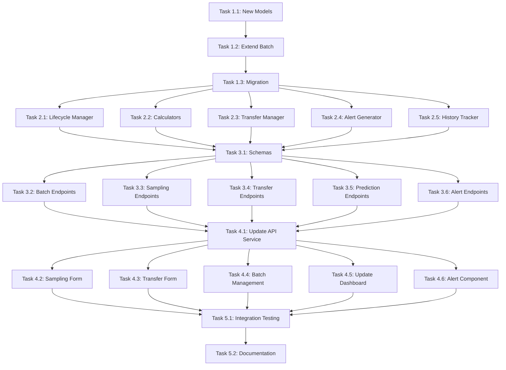

# Implementation Tasks: Fish Lifecycle Management
# مهام التنفيذ: إدارة دورة حياة السمكة

## Overview

This document breaks down the fish lifecycle management feature into concrete implementation tasks. Each task is designed to be independently testable and contributes to one or more requirements from the requirements document.

**Total Estimated Time**: 23-31 hours (3-4 days)

---

## Phase 1: Database Layer (4-6 hours)

### Task 1.1: Create New Database Models
**Priority**: Critical  
**Estimated Time**: 2-3 hours  
**Requirements**: REQ-12 (Batch History Tracking)

**Description**: Create four new SQLAlchemy models for lifecycle tracking.

**Implementation**:
1. Create `backend/app/models/batch_history.py`
   - BatchHistory model with all fields from design
   - Relationships to Batch and Pond models
2. Create `backend/app/models/sampling.py`
   - Sampling model for weight sampling records
   - Relationship to Batch model
3. Create `backend/app/models/transfer.py`
   - Transfer model for inter-pond transfers
   - Relationships to Batch and Pond models
4. Create `backend/app/models/alert.py`
   - Alert model for automatic notifications
   - Relationships to Batch and Pond models
5. Update `backend/app/models/__init__.py` to export new models

**Acceptance Criteria**:
- [ ] All four models created with correct fields
- [ ] All relationships properly defined
- [ ] Models follow existing code style
- [ ] No import errors

**Files to Create**:
- `backend/app/models/batch_history.py`
- `backend/app/models/sampling.py`
- `backend/app/models/transfer.py`
- `backend/app/models/alert.py`

**Files to Modify**:
- `backend/app/models/__init__.py`

---

### Task 1.2: Extend Batch Model
**Priority**: Critical  
**Estimated Time**: 1 hour  
**Requirements**: REQ-3 (Biomass), REQ-4 (FCR), REQ-5 (SGR), REQ-6 (Mortality Rate)

**Description**: Add calculated fields to existing Batch model.

**Implementation**:
1. Open `backend/app/models/pond.py`
2. Add new columns to Batch class:
   - biomass (Float)
   - total_feed_consumed (Float, default=0.0)
   - fcr (Float)
   - sgr (Float)
   - mortality_rate (Float, default=0.0)
   - survival_rate (Float, default=100.0)
   - previous_avg_weight (Float)
   - last_sampling_date (DateTime)
   - harvest_date (DateTime)
   - cycle_duration (Integer)
3. Add relationships to new models:
   - history (BatchHistory)
   - samplings (Sampling)
   - transfers (Transfer)
   - alerts (Alert)

**Acceptance Criteria**:
- [ ] All new fields added with correct types
- [ ] All relationships defined with cascade delete
- [ ] Existing batch functionality still works
- [ ] No breaking changes to existing API

**Files to Modify**:
- `backend/app/models/pond.py`

---

### Task 1.3: Create Database Migration
**Priority**: Critical  
**Estimated Time**: 1-2 hours  
**Requirements**: All database requirements

**Description**: Create and test database migration script.

**Implementation**:
1. Create `backend/migrations/add_lifecycle_tables.sql`
2. Add ALTER TABLE statements for batches table
3. Add CREATE TABLE statements for new tables
4. Add CREATE INDEX statements
5. Create Python migration script `backend/migrations/migrate_lifecycle.py`
6. Test migration on development database
7. Create rollback script if needed

**Acceptance Criteria**:
- [ ] Migration script runs without errors
- [ ] All tables created successfully
- [ ] All indexes created
- [ ] Existing data preserved
- [ ] Can rollback if needed

**Files to Create**:
- `backend/migrations/add_lifecycle_tables.sql`
- `backend/migrations/migrate_lifecycle.py`

---

## Phase 2: Service Layer (8-10 hours)

### Task 2.1: Create Lifecycle Manager Service
**Priority**: Critical  
**Estimated Time**: 2 hours  
**Requirements**: REQ-2 (Lifecycle Stage Management)

**Description**: Implement service for managing lifecycle stage transitions.

**Implementation**:
1. Create `backend/app/services/lifecycle_manager.py`
2. Implement `LifecycleManager` class with:
   - `STAGE_THRESHOLDS` constant
   - `determine_stage(avg_weight)` method
   - `update_stage(batch, db)` method
   - `get_stage_info(stage)` method
3. Add unit tests in `backend/tests/test_lifecycle_manager.py`

**Acceptance Criteria**:
- [ ] Correctly determines stage based on weight
- [ ] Updates batch stage when threshold crossed
- [ ] Returns appropriate stage information
- [ ] All unit tests pass

**Files to Create**:
- `backend/app/services/lifecycle_manager.py`
- `backend/tests/test_lifecycle_manager.py`

---

### Task 2.2: Create Calculator Services
**Priority**: Critical  
**Estimated Time**: 3-4 hours  
**Requirements**: REQ-3, REQ-4, REQ-5, REQ-6, REQ-9, REQ-10

**Description**: Implement calculation engines for all KPIs.

**Implementation**:
1. Create `backend/app/services/calculators.py` with:
   - `BiomassCalculator` class
   - `FCRCalculator` class
   - `SGRCalculator` class
   - `WeightPredictor` class
   - `HarvestPredictor` class
   - `FeedingCalculator` class
2. Implement all calculation methods per design document
3. Add comprehensive unit tests

**Acceptance Criteria**:
- [ ] Biomass calculation: count × avg_weight
- [ ] FCR calculation: total_feed / weight_gained
- [ ] SGR calculation: ((ln(W2) - ln(W1)) / days) × 100
- [ ] Weight prediction: current × e^(SGR × days / 100)
- [ ] Harvest prediction: (ln(target) - ln(current)) / (SGR / 100)
- [ ] Feed calculation: biomass × feeding_rate
- [ ] All calculations handle edge cases (zero, negative, null)
- [ ] All unit tests pass

**Files to Create**:
- `backend/app/services/calculators.py`
- `backend/tests/test_calculators.py`

---

### Task 2.3: Create Transfer Manager Service
**Priority**: High  
**Estimated Time**: 2 hours  
**Requirements**: REQ-8 (Inter-Pond Transfer)

**Description**: Implement service for managing inter-pond transfers.

**Implementation**:
1. Create `backend/app/services/transfer_manager.py`
2. Implement `TransferManager` class with:
   - `validate_transfer()` method
   - `execute_transfer()` method
   - `check_transfer_readiness()` method
3. Add unit tests

**Acceptance Criteria**:
- [ ] Validates transfer count ≤ current count
- [ ] Validates from_pond matches batch.pond_id
- [ ] Validates to_pond exists and is available
- [ ] Updates batch.pond_id
- [ ] Updates batch.current_count
- [ ] Creates Transfer record
- [ ] Creates BatchHistory record
- [ ] All unit tests pass

**Files to Create**:
- `backend/app/services/transfer_manager.py`
- `backend/tests/test_transfer_manager.py`

---

### Task 2.4: Create Alert Generator Service
**Priority**: High  
**Estimated Time**: 1-2 hours  
**Requirements**: REQ-14 (Automatic Alert Generation)

**Description**: Implement service for generating automatic alerts.

**Implementation**:
1. Create `backend/app/services/alert_generator.py`
2. Implement `AlertGenerator` class with:
   - `THRESHOLDS` constant
   - `check_fcr_alert()` method
   - `check_sgr_alert()` method
   - `check_mortality_alert()` method
   - `check_transfer_alert()` method
   - `check_harvest_alert()` method
   - `check_water_quality_alert()` method
3. Add unit tests

**Acceptance Criteria**:
- [ ] FCR alert when > 1.8
- [ ] SGR alert when < 5.0%
- [ ] Mortality alert when exceeds stage threshold
- [ ] Transfer alert when weight reaches threshold
- [ ] Harvest alert when weight 350-600g
- [ ] Water quality alert when outside range
- [ ] All unit tests pass

**Files to Create**:
- `backend/app/services/alert_generator.py`
- `backend/tests/test_alert_generator.py`

---

### Task 2.5: Create History Tracker Service
**Priority**: Medium  
**Estimated Time**: 1 hour  
**Requirements**: REQ-12 (Batch History Tracking)

**Description**: Implement service for tracking batch history.

**Implementation**:
1. Create `backend/app/services/history_tracker.py`
2. Implement `HistoryTracker` class with:
   - `record_event()` method
   - `get_batch_history()` method
3. Add unit tests

**Acceptance Criteria**:
- [ ] Records all event types correctly
- [ ] Captures all relevant data
- [ ] Returns history ordered by date
- [ ] All unit tests pass

**Files to Create**:
- `backend/app/services/history_tracker.py`
- `backend/tests/test_history_tracker.py`

---

## Phase 3: API Layer (6-8 hours)

### Task 3.1: Create Pydantic Schemas
**Priority**: Critical  
**Estimated Time**: 1-2 hours  
**Requirements**: All API requirements

**Description**: Create request/response schemas for all new endpoints.

**Implementation**:
1. Create `backend/app/schemas/batch.py` with:
   - BatchCreate
   - BatchResponse
   - BatchDetailResponse
2. Create `backend/app/schemas/sampling.py` with:
   - SamplingCreate
   - SamplingResponse
3. Create `backend/app/schemas/transfer.py` with:
   - TransferCreate
   - TransferResponse
4. Create `backend/app/schemas/prediction.py` with:
   - WeightPredictionRequest/Response
   - HarvestPredictionRequest/Response
5. Create `backend/app/schemas/alert.py` with:
   - AlertResponse
6. Update `backend/app/schemas/__init__.py`

**Acceptance Criteria**:
- [ ] All schemas have correct field types
- [ ] All schemas have validation rules
- [ ] All schemas follow existing patterns
- [ ] No import errors

**Files to Create**:
- `backend/app/schemas/batch.py`
- `backend/app/schemas/sampling.py`
- `backend/app/schemas/transfer.py`
- `backend/app/schemas/prediction.py`
- `backend/app/schemas/alert.py`

**Files to Modify**:
- `backend/app/schemas/__init__.py`

---

### Task 3.2: Create Batch Endpoints
**Priority**: Critical  
**Estimated Time**: 2-3 hours  
**Requirements**: REQ-1 (Batch Creation), REQ-15 (Batch Reports)

**Description**: Implement comprehensive batch management endpoints.

**Implementation**:
1. Create `backend/app/api/routes/batches.py` with:
   - POST /api/batches (create batch)
   - GET /api/batches (list batches)
   - GET /api/batches/{id} (get batch details)
   - PATCH /api/batches/{id} (update batch)
   - DELETE /api/batches/{id} (delete batch)
   - GET /api/batches/active (get active batches)
   - GET /api/batches/by-stage/{stage} (get by stage)
   - GET /api/batches/{id}/history (get history)
   - GET /api/batches/{id}/metrics (get KPIs)
2. Integrate with services
3. Add authentication
4. Add error handling

**Acceptance Criteria**:
- [ ] All endpoints work correctly
- [ ] Proper authentication required
- [ ] Proper error messages
- [ ] Returns correct status codes
- [ ] Swagger documentation generated

**Files to Create**:
- `backend/app/api/routes/batches.py`

**Files to Modify**:
- `backend/app/main.py` (register router)

---

### Task 3.3: Create Sampling Endpoints
**Priority**: Critical  
**Estimated Time**: 1 hour  
**Requirements**: REQ-7 (Periodic Weight Sampling)

**Description**: Implement weight sampling endpoints.

**Implementation**:
1. Create `backend/app/api/routes/samplings.py` with:
   - POST /api/samplings (record sampling)
   - GET /api/samplings/batch/{id} (get batch samplings)
   - GET /api/samplings/{id} (get sampling details)
2. Integrate with calculators (SGR, biomass, stage update)
3. Integrate with alert generator
4. Integrate with history tracker

**Acceptance Criteria**:
- [ ] Validates sample_count ≥ 30
- [ ] Calculates avg_weight correctly
- [ ] Updates batch.avg_weight
- [ ] Calculates SGR
- [ ] Updates batch stage if needed
- [ ] Generates alerts if needed
- [ ] Records in history

**Files to Create**:
- `backend/app/api/routes/samplings.py`

**Files to Modify**:
- `backend/app/main.py`

---

### Task 3.4: Create Transfer Endpoints
**Priority**: High  
**Estimated Time**: 1 hour  
**Requirements**: REQ-8 (Inter-Pond Transfer)

**Description**: Implement transfer management endpoints.

**Implementation**:
1. Create `backend/app/api/routes/transfers.py` with:
   - POST /api/transfers (execute transfer)
   - GET /api/transfers/batch/{id} (get batch transfers)
   - GET /api/transfers/{id} (get transfer details)
   - GET /api/transfers/validate (validate transfer)
2. Integrate with TransferManager service

**Acceptance Criteria**:
- [ ] Validates transfer before execution
- [ ] Executes transfer atomically
- [ ] Returns proper error messages
- [ ] Records in history

**Files to Create**:
- `backend/app/api/routes/transfers.py`

**Files to Modify**:
- `backend/app/main.py`

---

### Task 3.5: Create Prediction Endpoints
**Priority**: Medium  
**Estimated Time**: 1 hour  
**Requirements**: REQ-9 (Weight Prediction), REQ-10 (Harvest Date Prediction)

**Description**: Implement prediction endpoints.

**Implementation**:
1. Create `backend/app/api/routes/predictions.py` with:
   - POST /api/predictions/weight (predict weight)
   - POST /api/predictions/harvest (predict harvest date)
   - GET /api/predictions/batch/{id} (get all predictions)
2. Integrate with predictor services

**Acceptance Criteria**:
- [ ] Weight prediction works correctly
- [ ] Harvest prediction works correctly
- [ ] Returns confidence level
- [ ] Handles edge cases (no SGR data)

**Files to Create**:
- `backend/app/api/routes/predictions.py`

**Files to Modify**:
- `backend/app/main.py`

---

### Task 3.6: Create Alert Endpoints
**Priority**: Medium  
**Estimated Time**: 1 hour  
**Requirements**: REQ-14 (Automatic Alert Generation)

**Description**: Implement alert management endpoints.

**Implementation**:
1. Create `backend/app/api/routes/alerts.py` with:
   - GET /api/alerts (get all alerts)
   - GET /api/alerts/unread (get unread)
   - GET /api/alerts/batch/{id} (get batch alerts)
   - PATCH /api/alerts/{id}/read (mark as read)
   - PATCH /api/alerts/{id}/resolve (resolve alert)

**Acceptance Criteria**:
- [ ] Returns alerts correctly
- [ ] Filters work correctly
- [ ] Can mark as read
- [ ] Can resolve alerts

**Files to Create**:
- `backend/app/api/routes/alerts.py`

**Files to Modify**:
- `backend/app/main.py`

---

## Phase 4: Frontend Integration (5-7 hours)

### Task 4.1: Update API Service
**Priority**: Critical  
**Estimated Time**: 1 hour  
**Requirements**: All frontend requirements

**Description**: Add new API methods to frontend service.

**Implementation**:
1. Open `src/services/api.js`
2. Add batch methods:
   - createBatch()
   - getBatches()
   - getBatchDetails()
   - updateBatch()
   - deleteBatch()
   - getActiveBatches()
   - getBatchesByStage()
   - getBatchHistory()
   - getBatchMetrics()
3. Add sampling methods:
   - createSampling()
   - getBatchSamplings()
4. Add transfer methods:
   - createTransfer()
   - getBatchTransfers()
   - validateTransfer()
5. Add prediction methods:
   - predictWeight()
   - predictHarvest()
6. Add alert methods:
   - getAlerts()
   - getUnreadAlerts()
   - markAlertRead()
   - resolveAlert()

**Acceptance Criteria**:
- [ ] All methods implemented
- [ ] Proper error handling
- [ ] Token included in requests
- [ ] Follows existing patterns

**Files to Modify**:
- `src/services/api.js`

---

### Task 4.2: Create Sampling Form
**Priority**: Critical  
**Estimated Time**: 2 hours  
**Requirements**: REQ-7 (Periodic Weight Sampling)

**Description**: Create weight sampling form component.

**Implementation**:
1. Create `src/components/Forms/SamplingForm.jsx`
2. Implement form with fields:
   - Sample count (minimum 30)
   - Total sample weight
   - Sampled by
   - Notes
3. Add validation
4. Calculate and display avg_weight
5. Integrate with API
6. Add to PondDetails page

**Acceptance Criteria**:
- [ ] Form validates sample_count ≥ 30
- [ ] Calculates avg_weight correctly
- [ ] Shows success/error messages
- [ ] Updates batch data after submission
- [ ] Bilingual (Arabic/English)
- [ ] Mobile responsive

**Files to Create**:
- `src/components/Forms/SamplingForm.jsx`

**Files to Modify**:
- `src/pages/PondDetails.jsx`
- `src/i18n/locales/ar.json`
- `src/i18n/locales/en.json`

---

### Task 4.3: Create Transfer Form
**Priority**: High  
**Estimated Time**: 2 hours  
**Requirements**: REQ-8 (Inter-Pond Transfer)

**Description**: Create inter-pond transfer form component.

**Implementation**:
1. Create `src/components/Forms/TransferForm.jsx`
2. Implement form with fields:
   - From pond (auto-filled, read-only)
   - To pond (dropdown)
   - Transfer count
   - Transferred by
   - Notes
3. Add validation
4. Show batch info (current count, avg weight, stage)
5. Integrate with API
6. Add to PondDetails page

**Acceptance Criteria**:
- [ ] Validates transfer_count ≤ current_count
- [ ] Shows available ponds
- [ ] Shows batch information
- [ ] Confirms before transfer
- [ ] Shows success/error messages
- [ ] Bilingual
- [ ] Mobile responsive

**Files to Create**:
- `src/components/Forms/TransferForm.jsx`

**Files to Modify**:
- `src/pages/PondDetails.jsx`
- `src/i18n/locales/ar.json`
- `src/i18n/locales/en.json`

---

### Task 4.4: Create Batch Management Page
**Priority**: High  
**Estimated Time**: 2-3 hours  
**Requirements**: REQ-1, REQ-15, REQ-16

**Description**: Create comprehensive batch management page.

**Implementation**:
1. Create `src/pages/BatchManagement.jsx`
2. Implement features:
   - List all batches with filters (stage, status, pond)
   - Batch cards showing key metrics (FCR, SGR, biomass, mortality)
   - Quick actions (view details, transfer, harvest)
   - Create new batch button
3. Add sorting and filtering
4. Add pagination
5. Integrate BatchForm
6. Add to navigation

**Acceptance Criteria**:
- [ ] Shows all batches
- [ ] Filters work correctly
- [ ] Shows key metrics
- [ ] Quick actions work
- [ ] Can create new batch
- [ ] Bilingual
- [ ] Mobile responsive

**Files to Create**:
- `src/pages/BatchManagement.jsx`

**Files to Modify**:
- `src/App.jsx` (add route)
- `src/components/Layout/Sidebar.jsx` (add menu item)
- `src/i18n/locales/ar.json`
- `src/i18n/locales/en.json`

---

### Task 4.5: Update Dashboard with Real Data
**Priority**: High  
**Estimated Time**: 1 hour  
**Requirements**: REQ-16 (Multi-Batch Dashboard)

**Description**: Replace mock data with real API data in Dashboard.

**Implementation**:
1. Open `src/pages/Dashboard.jsx`
2. Replace mock data with API calls:
   - getActiveBatches()
   - getPonds()
   - getAlerts()
3. Calculate dashboard metrics from real data:
   - Total biomass
   - Average FCR
   - Average SGR
   - Total mortality rate
   - Active batches count
4. Add loading states
5. Add error handling

**Acceptance Criteria**:
- [ ] Shows real data from database
- [ ] Metrics calculated correctly
- [ ] Loading states work
- [ ] Error handling works
- [ ] Updates in real-time

**Files to Modify**:
- `src/pages/Dashboard.jsx`

---

### Task 4.6: Create Alert Notification Component
**Priority**: Medium  
**Estimated Time**: 1 hour  
**Requirements**: REQ-14 (Automatic Alert Generation)

**Description**: Create alert notification component in header.

**Implementation**:
1. Create `src/components/Layout/AlertBell.jsx`
2. Implement features:
   - Bell icon with unread count badge
   - Dropdown showing recent alerts
   - Color-coded by severity (info, warning, critical)
   - Click to mark as read
   - Click to navigate to relevant page
3. Poll for new alerts every 30 seconds
4. Add to Header component

**Acceptance Criteria**:
- [ ] Shows unread count
- [ ] Displays recent alerts
- [ ] Color-coded correctly
- [ ] Can mark as read
- [ ] Navigates correctly
- [ ] Polls for updates
- [ ] Bilingual

**Files to Create**:
- `src/components/Layout/AlertBell.jsx`

**Files to Modify**:
- `src/components/Layout/Header.jsx`
- `src/i18n/locales/ar.json`
- `src/i18n/locales/en.json`

---

## Phase 5: Testing & Documentation (2-3 hours)

### Task 5.1: Integration Testing
**Priority**: High  
**Estimated Time**: 1-2 hours  
**Requirements**: All requirements

**Description**: Test complete workflows end-to-end.

**Implementation**:
1. Test batch creation workflow
2. Test sampling workflow
3. Test transfer workflow
4. Test harvest workflow
5. Test alert generation
6. Test calculations accuracy
7. Test edge cases

**Acceptance Criteria**:
- [ ] All workflows work end-to-end
- [ ] Calculations are accurate
- [ ] Alerts generate correctly
- [ ] No data loss
- [ ] No breaking errors

---

### Task 5.2: Update Documentation
**Priority**: Medium  
**Estimated Time**: 1 hour  
**Requirements**: All requirements

**Description**: Update project documentation.

**Implementation**:
1. Update `FEATURES.md` with new features
2. Update `CURRENT_STATUS.md` to 100%
3. Update `BACKEND_GUIDE.md` with new endpoints
4. Update `DATA_ENTRY_GUIDE.md` with new forms
5. Create `LIFECYCLE_USER_GUIDE.md` for end users

**Acceptance Criteria**:
- [ ] All documentation updated
- [ ] Accurate and complete
- [ ] Bilingual where appropriate

**Files to Modify**:
- `FEATURES.md`
- `CURRENT_STATUS.md`
- `BACKEND_GUIDE.md`
- `DATA_ENTRY_GUIDE.md`

**Files to Create**:
- `LIFECYCLE_USER_GUIDE.md`

---

## Task Dependencies

---

## Implementation Order

### Day 1: Database & Services (4-6 hours)
1. Task 1.1: Create New Models
2. Task 1.2: Extend Batch Model
3. Task 1.3: Database Migration
4. Task 2.1: Lifecycle Manager
5. Task 2.2: Calculators

### Day 2: Services & API (6-8 hours)
6. Task 2.3: Transfer Manager
7. Task 2.4: Alert Generator
8. Task 2.5: History Tracker
9. Task 3.1: Schemas
10. Task 3.2: Batch Endpoints
11. Task 3.3: Sampling Endpoints
12. Task 3.4: Transfer Endpoints

### Day 3: API & Frontend (6-8 hours)
13. Task 3.5: Prediction Endpoints
14. Task 3.6: Alert Endpoints
15. Task 4.1: Update API Service
16. Task 4.2: Sampling Form
17. Task 4.3: Transfer Form

### Day 4: Frontend & Testing (5-7 hours)
18. Task 4.4: Batch Management Page
19. Task 4.5: Update Dashboard
20. Task 4.6: Alert Component
21. Task 5.1: Integration Testing
22. Task 5.2: Documentation

---

## Success Criteria

The implementation is complete when:

1. ✅ All 22 tasks completed
2. ✅ All 20 requirements satisfied
3. ✅ All unit tests passing
4. ✅ All integration tests passing
5. ✅ Database migration successful
6. ✅ All API endpoints working
7. ✅ All frontend forms working
8. ✅ Real data displayed in dashboard
9. ✅ Alerts generating correctly
10. ✅ Documentation updated
11. ✅ No breaking changes to existing features
12. ✅ System reaches 100% completion

---

## Notes

- Each task should be completed and tested before moving to the next
- Run database migration on a backup first
- Test calculations with known values
- Verify all formulas match scientific standards
- Ensure bilingual support in all UI components
- Follow existing code style and patterns
- Add comprehensive error handling
- Log all important operations
- Consider performance for large datasets
- Plan for future offline support
